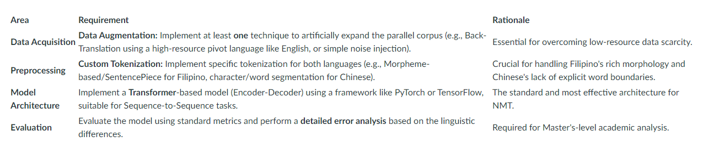
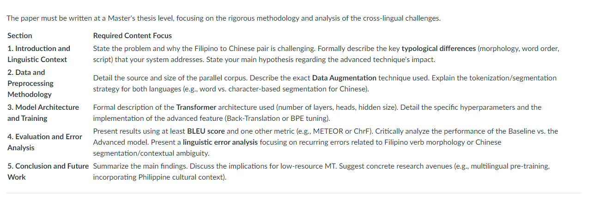
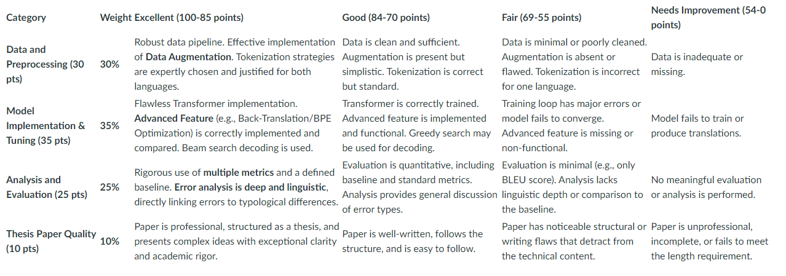

# Final Project: Low-Resource Machine Translation System Development
## Project Goal

    The goal is to design, implement, and rigorously evaluate a Neural Machine Translation (NMT) system for the Filipino (Tagalog) to Chinese (Mandarin) language pair. (just an example) This project requires addressing the typical challenges of low-resource MT, including data sparsity and significant typological differences.

 

## Project Deliverables
 

    - Project Proposal (2 pages: Defining the approach, data sources, and model architecture).

    - Working Codebase & Trained Model (Code for preprocessing, training, and a final, usable model file).

    - Final Masteral Technical Thesis Paper (12-15 pages: Methodology, Results, and Analysis).

    - Final Defense Presentation (20 minutes).

 

## 1. Project Scenario: (Sample only) Filipino to Chinese NMT 
 

 

### **The Challenge**
 

    The Filipino (Tagalog) to Chinese (Mandarin) language pair presents several advanced MT challenges:

        1. Low Resource: Publicly available, high-quality parallel corpora are scarce compared to high-resource languages.

        2. Typological Difference: Filipino is a subject-verb-object (SVO) or verb-subject-object (VSO) language with complex verb morphology, while Chinese is strictly SVO and uses character-based logograms, requiring unique tokenization and encoding strategies.

        3. Context and Ambiguity: Filipino often relies on context and discourse markers (like "na" or "po/opo") that have no direct translation in Chinese and must be interpreted structurally.

 

### **Required Focus and Techniques**
 

 

## 2. Technical Requirements
 

 

### 2.1. The Pipeline Implementation
 

        - Data Curation: Acquire, clean, and align an initial parallel corpus (minimum of 50,000 sentence pairs required).

        - Pre-processing and Vocabulary: Implement a tokenizer (e.g., using Hugging Face's tokenizers library) and create the vocabulary for both source and target languages.

        - Model Training: Implement the full training loop for the Transformer model, including loss calculation, backpropagation, and hyperparameter tuning (e.g., learning rate scheduling, dropout).

        - Inference (Translation): Implement the Beam Search algorithm for decoding, as it produces higher quality translations than greedy search.

 

### 2.2. Advanced Feature (Model Tuning)
 

        - You must implement and compare the results of the baseline model against a model incorporating one advanced technique:

            Option A: Fine-tuning with Back-Translation: Translate a large monolingual Chinese corpus into Filipino (using an external tool/model) and use this synthetic parallel data to fine-tune your primary model.

            Option B: Byte-Pair Encoding (BPE) Optimization: Systematically experiment with different BPE vocabulary sizes to find the optimal balance between token length (efficiency) and morphological coherence (accuracy) for Filipino.

## 3. Final Technical Thesis Paper (12-15 Pages)

## 4. Project Rubric (Total Points: 100)

