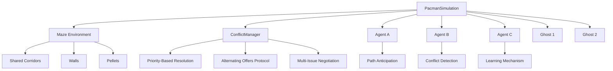

# Enhanced Multi-Agent Pac-Man Simulation

## Project Overview

This project implements an advanced Multi-Agent System (MAS) simulation based on the classic Pac-Man game environment. The simulation features three autonomous Pac-Man agents that must navigate a maze, collect pellets, and resolve conflicts over shared resources while avoiding ghosts. The system demonstrates sophisticated conflict resolution mechanisms, negotiation protocols, and synchronization strategies in a dynamic multi-agent environment.

### Scenario Description

- **Environment**: Classic Pac-Man maze (10x10 grid) with walls, pellets, power pellets, and shared corridors
- **Agents**: 3 autonomous Pac-Man players (PacmanA, PacmanB, PacmanC) with individual goals and capabilities
- **Ghosts**: 2 adversarial agents that chase Pac-Man agents
- **Conflict Points**: Shared corridor resources that require negotiation and synchronization
- **Objective**: Collect pellets while efficiently resolving conflicts to maximize individual scores and survival

## Multi-Agent System Architecture

### System Components



### Agent Communication Protocols

The system implements three distinct negotiation strategies:

1. **Priority-Based Resolution** (Baseline)
   - Deterministic conflict resolution
   - Highest score agent wins access
   - Efficient but potentially unfair

2. **Alternating Offers Protocol** (Formal Negotiation)
   - Structured message exchange
   - Utility-based proposal evaluation
   - Multiple negotiation rounds with fallback

3. **Multi-Issue Negotiation** (Advanced)
   - Trade-off proposals (corridor access vs pellet sharing)
   - Complex utility calculations
   - Learning from negotiation outcomes

### Class Structure and Relationships

#### Core Classes

- **`Maze`**: Environment management with shared corridor locking
- **`Agent`**: Autonomous Pac-Man agents with learning capabilities
- **`Ghost`**: Adversarial chasing agents
- **`ConflictManager`**: Centralized conflict resolution and negotiation
- **`PacmanSimulation`**: Main simulation controller
- **`PacmanVisualizer`**: Pygame-based visualization system

## Installation and Setup

### Prerequisites

- Python 3.7 or higher
- Required packages: `pygame` (for visualization)

### Installation Steps

1. **Clone or download the project files**:
   ```bash
   # Ensure you have the following files in your project directory:
   # - pacman_simulation.py
   # - pacman_visualizer.py
   # - README.md (this file)
   ```

2. **Install Pygame (for visualization mode)**:
   ```bash
   pip install pygame
   ```

3. **Verify installation**:
   ```bash
   python -c "import pygame; print('Pygame installed successfully')"
   ```

### Project Structure

```
final_project/
├── pacman_simulation.py    # Core simulation logic
├── pacman_visualizer.py    # Visualization system
├── README.md               # This documentation
└── requirements.txt        # Python dependencies
```

## How to Run the Simulation

### Text-Based Mode (No Visualization)

Run the simulation in text-only mode for performance analysis:

```bash
python pacman_simulation.py
```

**Text Mode Features**:
- Real-time maze display in console
- Detailed conflict logging
- Performance metrics output
- No external dependencies required

### Visual Mode (With Pygame)

Run the enhanced visualization for interactive analysis:

```bash
python pacman_visualizer.py
```

**Visual Mode Features**:
- Real-time graphical display
- Conflict visualization with pulsating alerts
- Path anticipation indicators
- Comprehensive metrics panel
- Negotiation message display
- Pause/resume functionality (SPACE key)

### Simulation Controls (Visual Mode)

- **SPACE**: Pause/Resume simulation
- **ESC**: Exit simulation
- **Close Window**: Terminate program

## Conflict Resolution Mechanisms

### Conflict Detection

#### Pre-Detection System
- **Sensing Radius**: 3-cell radius around each agent
- **Path Anticipation**: 1-2 move lookahead prediction
- **Local Sensing**: Agent proximity analysis

```python
def detect_potential_conflicts(self, agents, maze):
    """Detect potential conflicts within sensing radius"""
    potential_conflicts = []
    # Implementation analyzes agent movements and predicts collisions
```

#### Shared Corridor Locking
- **Exclusive Access**: Token-based synchronization
- **Lock/Unlock Mechanism**: Environment-managed resource control
- **Conflict Events**: Triggered when multiple agents attempt same corridor

### Resolution Strategies

#### 1. Priority-Based Resolution
```python
def resolve_conflict(self, contenders):
    """Negotiation Strategy 1: Priority-based resolution"""
    # Higher score wins, with random tie-breaking
    contenders.sort(key=lambda a: (a.score, a.energy), reverse=True)
```

**Characteristics**:
- Deterministic and efficient
- Potential fairness issues
- Minimal communication overhead

#### 2. Alternating Offers Protocol
```python
def alternating_offer_negotiate(self, contenders, maze):
    """Negotiation Strategy 2: Formal alternating offers protocol"""
    # Multi-round proposal exchange with utility evaluation
```

**Protocol Flow**:
1. Initial proposal from lower-priority agent
2. Utility evaluation by receiver
3. Counter-proposal or acceptance
4. Maximum 3 rounds before fallback

#### 3. Multi-Issue Negotiation
- **Trade Proposals**: Corridor access vs future pellet sharing
- **Complex Utilities**: Multi-factor decision making
- **Learning Integration**: Adaptation based on past outcomes

### Synchronization Mechanisms

#### Token Passing System
- **Round-Robin Access**: Sequential token distribution
- **Fair Resource Allocation**: Ensures all agents get corridor access
- **Deadlock Prevention**: Guaranteed progress mechanism

```python
# Token passing implementation
token_holder = (token_holder + 1) % len(active_agents)
```

## Agent Learning and Intelligence

### Reinforcement Learning
- **Negotiation History**: Track past interaction outcomes
- **Strategy Adaptation**: Adjust behavior based on success rates
- **Learning Rate**: 0.1 parameter for gradual adaptation

```python
def learn_from_negotiation(self, success, opponent, issue):
    """Simple reinforcement learning from negotiation outcomes"""
    self.negotiation_history.append((success, opponent, issue))
```

### Path Planning and Anticipation
- **Breadth-First Movement**: Simple pathfinding for pellet collection
- **Conflict Avoidance**: Pre-emptive route adjustment
- **Ghost Evasion**: Distance-based threat assessment

## Performance Metrics and Analysis

### Data Collection

The system comprehensively logs:

- **Conflict Metrics**:
  - Total conflicts detected
  - Successful negotiations
  - Pre-detected conflicts
  - Resolution strategy distribution

- **Agent Performance**:
  - Individual scores and energy levels
  - Waiting times and efficiency
  - Negotiation success rates
  - Survival duration

- **System Metrics**:
  - Fairness index (Gini coefficient approximation)
  - Average waiting time per agent
  - Resource utilization efficiency

### Metrics Reporting

```python
def report_metrics(self):
    """Comprehensive performance analysis and reporting"""
    # Calculates and displays all key performance indicators
```

### Key Performance Indicators

1. **Conflict Resolution Efficiency**:
   - Success rate of negotiations
   - Time to resolution
   - Strategy effectiveness comparison

2. **System Fairness**:
   - Gini coefficient for score distribution
   - Equal access to shared resources
   - Waiting time distribution

3. **Agent Performance**:
   - Score accumulation rates
   - Survival rates and duration
   - Energy management efficiency

## Technical Implementation Details

### Core Algorithms

#### Conflict Detection Algorithm
```python
# Pseudocode for conflict detection
for each agent:
    predict next 1-2 moves
    for each other agent in sensing radius:
        if predicted positions overlap:
            trigger conflict event
```

#### Alternating Offers Protocol
```python
# Pseudocode for alternating offers
initialize max_rounds = 3
while current_round < max_rounds:
    proposer makes offer
    receiver evaluates utility
    if utility > threshold:
        accept and resolve
    else:
        make counter-offer
        current_round += 1
fallback to priority-based resolution
```

### Data Structures

- **Maze Grid**: 2D list representing game state
- **Shared Corridor Status**: Dictionary tracking locked positions
- **Conflict Log**: List of all conflict events with timestamps
- **Negotiation History**: Per-agent learning database

### Key Methods and Functions

#### [`Maze.lock()`](pacman_simulation.py:46)
- Manages exclusive access to shared corridors
- Returns boolean indicating lock success

#### [`Agent.detect_potential_conflicts()`](pacman_simulation.py:129)
- Implements pre-conflict detection
- Uses sensing radius and path prediction

#### [`ConflictManager.alternating_offer_negotiate()`](pacman_simulation.py:272)
- Formal negotiation protocol implementation
- Handles multi-round proposal exchanges

#### [`PacmanSimulation.run()`](pacman_simulation.py:420)
- Main simulation loop
- Coordinates all system components

## Usage Examples and Troubleshooting

### Basic Usage

**Running a quick simulation**:
```bash
python pacman_simulation.py
```

**Detailed visualization analysis**:
```bash
python pacman_visualizer.py
```

### Common Issues and Solutions

1. **Pygame Import Error**:
   ```
   Solution: pip install pygame
   ```

2. **Simulation Runs Too Fast/Slow**:
   ```
   Adjust clock.tick() value in pacman_visualizer.py (line 422)
   ```

3. **No Visualization Output**:
   ```
   Ensure pygame installation and check console for error messages
   ```

### Customization Options

**Modifying Simulation Parameters**:
```python
# In pacman_simulation.py __init__ method
self.turns = 100  # Increase simulation duration
self.agents[0].energy = 150  # Adjust agent starting energy
```

**Adding New Negotiation Strategies**:
```python
# Extend ConflictManager class with new methods
def new_negotiation_strategy(self, contenders):
    # Implement custom negotiation logic
```

## Academic Context and Learning Outcomes

This project demonstrates key Multi-Agent System concepts:

- **Distributed Problem Solving**: Agents cooperate and compete
- **Conflict Resolution**: Multiple strategy comparison
- **Resource Management**: Shared corridor synchronization
- **Learning and Adaptation**: Agent behavior evolution
- **System Performance Analysis**: Quantitative metric evaluation

The implementation provides a practical framework for studying:
- Negotiation protocol effectiveness
- Learning algorithm impact on system performance
- Fairness vs efficiency trade-offs
- Scalability of conflict resolution mechanisms

## Future Extensions

Potential enhancements for further research:

1. **Advanced Learning Algorithms**:
   - Deep reinforcement learning for negotiation
   - Predictive modeling of opponent behavior

2. **Extended Protocol Support**:
   - Contract Net protocol implementation
   - Auction-based resource allocation

3. **Scalability Improvements**:
   - Larger maze environments
   - Increased agent populations
   - Distributed negotiation mechanisms

4. **Additional Metrics**:
   - Social welfare optimization
   - Long-term strategy analysis
   - Evolutionary algorithm integration

## Conclusion

This Enhanced Multi-Agent Pac-Man Simulation provides a comprehensive platform for studying complex multi-agent interactions, conflict resolution strategies, and adaptive learning in dynamic environments. The system's modular architecture and extensive logging capabilities make it suitable for both educational demonstrations and advanced research in multi-agent systems.

The implementation successfully demonstrates the trade-offs between different negotiation strategies and provides valuable insights into the challenges of resource management in competitive multi-agent environments.