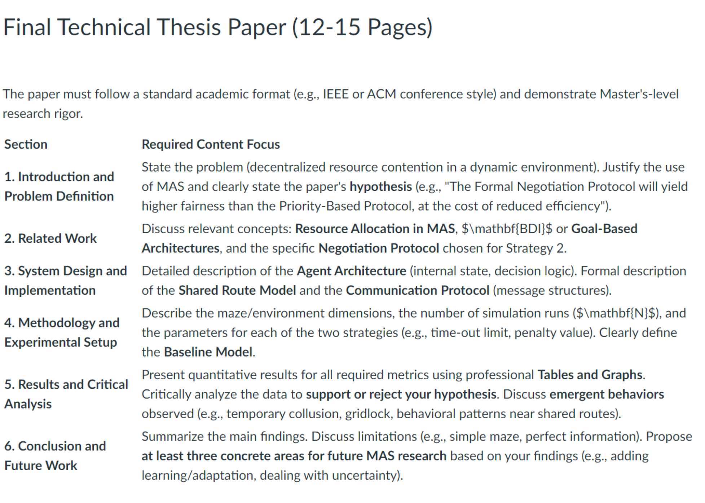

## Final Project Progress 1

### **Scenario**
- Environment: Classic Pac-Man maze (grid with walls, pellets, and power pellets).

- Agents: 3 Pac-Man players (autonomous agents, not ghosts). Each has a goal to collect points by eating pellets and staying alive.

- Conflict: Certain critical routes (corridors) must be shared. If two or more agents attempt to take the same corridor simultaneously, they clash and one may be forced to wait or reroute.

- Challenge: Agents must negotiate rights of way or synchronize traversal of shared routes to stay in the game.

### **Required Features**
1. **Environment**

    - Maze grid with walls, pellets, and “shared route” corridors.

    - Pac-Men can move up, down, left, right (no diagonal).

2. **Agents**

    - Each agent has an energy bar or score counter.

    - They collect pellets for points.

    - If they fail to resolve conflicts properly, they “stall” or lose points.

3. **Negotiation & Conflict Resolution**

    - When two or more agents want the same corridor at the same time:

    - Negotiation: Agents propose who goes first (e.g., based on score, random lottery, or alternating offers).

    - Conflict Resolution: If no agreement, apply fallback (priority rule, penalty, or random arbitration).

4. **Synchronization**

    - If multiple agents need to coordinate traversal (e.g., crossing intersection), they can synchronize by token passing or barrier synchronization.

5. **Win/Survival Condition**

    - Agents must keep collecting pellets while resolving conflicts.

    - An agent “drops out” if it repeatedly fails to negotiate or loses too much energy.

    - Winner is the one with the highest score after all pellets are consumed or a time limit ends.

### **Metrics to Record**

- Number of conflicts detected.

- Number of successful negotiations.

- Average waiting time per agent.

- Fairness in access to shared routes.

- Total score per agent.

## **Project Progress 2 (Final)**

### **Next Steps: Conflict Detection and Protocol Implementation** 

### **Phase 1: Conflict Detection and Synchronization (Core Mechanism)**

    This phase establishes the when and how of resource contention.

1. **Refine the Environment and State**

    Your environment needs to manage the "lock" for the critical resource.

    1.1. Create Shared Route Status:

        - Modify your environment grid to explicitly track the status of each Shared Route Corridor. This can be a simple array or dictionary mapping the corridor ID to its state:

            - UNLOCKED (available)

            - LOCKED_BY_AGENT_A

    1.2. Implement the Mutual Exclusion Lock:

        - Create lock() and unlock() functions within the Environment/Referee Agent that agents must call before and after traversing a Shared Route.

        - If an agent attempts to lock() an already locked corridor, a Conflict Event is triggered.

2. **Implement Conflict Detection**

    Agents must anticipate and prevent collisions rather than just reacting to them.

    2.1. Path Anticipation:

        - After an agent runs its path-planning algorithm (BFS/A*), its planned path should include a check for the next Shared Route it intends to enter.

        - Implement an Agent.predict_next_move() function that looks 1-2 steps ahead.

    2.2. Conflict Pre-Detection (Local Sensing):

        - In the agent's perception loop, check if any other agent is currently occupying the target Shared Route or if another agent is within the defined sensing radius and also planning to enter the same Shared Route in the next 1-2 moves.

        - If a high-probability collision is detected, trigger the Negotiation/Conflict Event before the agent attempts to move into the route.

    2.3. Conflict Event Trigger:

        - Create an Environment.trigger_conflict(agent_A, agent_B, corridor_ID) function that pauses the normal movement of the involved agents and hands control over to the negotiation module.

### **Phase 2: Protocol Implementation and Comparison**

    This phase implements the two required strategies for your academic comparison.

3. Implement Negotiation Strategy 1: Priority-Based (Baseline)

    This is your control group. It is simple, deterministic, and highly efficient but likely unfair.

    3.1. Define the Priority Rule: Choose a single, deterministic rule for the baseline. A good choice is "Highest Score Wins" or "Lowest Health Wins."

    3.2. Implement the Fallback: When a conflict event is triggered, the system immediately compares the required metric (score or health).

    3.3. Action and Penalty:

        - The Winning Agent is granted the lock and proceeds.

        - The Losing Agent is forced into the WAIT state for a fixed number of turns (the efficiency cost) and incurs a minor penalty (e.g., -5 points) for the failed access attempt.

        - Log the waiting time and the outcome.

4. Implement Negotiation Strategy 2: Formal Protocol (Alternating Offers)
 

    This strategy requires structured communication and is the core of your MAS analysis.

    4.1. Define Message Structure:

        - Formalize the messages agents can exchange, including fields for: Sender ID, Receiver ID, Performative (e.g., PROPOSE, ACCEPT, REJECT), and Content (e.g., Access to Corridor C3 now, Wait for 2 turns).

    4.2. Implement the Alternating Offers Logic:

        - When a conflict is detected, the agent with the lower priority (e.g., based on arrival time) becomes the Proposer.

        - The Proposer sends a message: "I will go first, and you will wait 1 turn."

        - The Respondent (the other agent) evaluates the proposal based on a simple Utility Function (e.g., Is waiting 1 turn less costly than the penalty for a fallback?).

        - The Respondent can ACCEPT (leading to a successful negotiation) or REJECT (leading to the Respondent sending a counter-proposal).

    4.3. Implement Time-Out and Fallback:

        - Set a maximum number of rounds (e.g., 3) for the offers. If the limit is reached without an ACCEPT message, the negotiation fails.

        - The system applies the Conflict Resolution Fallback (random lottery or a fixed rule) and penalizes both agents heavily for inefficient negotiation (e.g., -15 points).

5. Data Logging
 
    - Crucially, ensure your code logs all required metrics immediately upon conflict resolution.

    - Log the Strategy Used, Conflict Time, Winning Agent, Waiting Time of Loser, Negotiation Rounds, and Final Outcome (Success/Fallback).

### **Create a final documentation with this format:**

4. Submission Details and Rubric
 
    4.1. Code Repository Submission
 

        The final repository must be a shared, version-controlled repository (e.g., GitHub, GitLab) containing:

            - All simulation code and agent classes.

            - A clear README.md file explaining how to run the simulation and reproduce the results.

            - The raw simulation output data (e.g., CSV files) used to generate the paper's figures.

